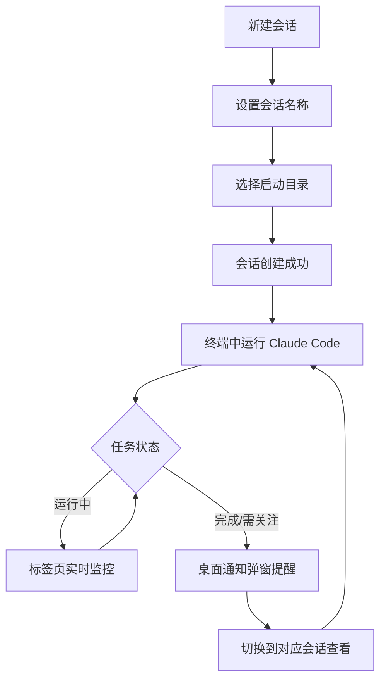

# cliDesk

cliDesk 是一个跨平台 Electron 桌面应用，用于管理多个 Claude Code 终端会话，支持 Windows 和 macOS。应用通过标签页和侧边栏管理不同会话，每个会话运行独立终端，并使用 xterm.js 在桌面窗口中渲染交互式命令行。

## 快速安装（Windows）

无需下载源码和部署环境，直接下载 exe 安装程序即可使用：

👉 **[下载 cliDesk Setup 1.0.0.exe](https://github.com/wei-jianhan/cliDesk/raw/master/cliDesk%20Setup%201.0.0.exe)**

> ⚠️ **安装提示**：本人为个人开发者，未办理代码签名证书，Windows 在安装时会提示"Windows 已保护你的电脑"风险警告。这是正常现象，点击 **"更多信息"** → **"仍要运行"** 即可继续安装。

## 项目概况

- Electron 主进程负责窗口、IPC、PTY 终端会话和桌面通知。
- React 渲染进程负责应用界面、标签页、侧边栏和终端视图。
- `@lydell/node-pty` 用于创建伪终端进程。
- `xterm.js` 用于终端渲染。
- Vite、esbuild 和 TypeScript 负责编译构建。

## 使用流程


## 使用案例
### 1、 持久化会话信息
	新建时可以选择clade code 启动目录，以后可以不需要每次区文件夹打开目录再启动claude code


## 2、实时监控会话运行状态
同时监控多个会话的运行状态


同时也有桌面弹窗，在切换到别的软件干别的事也不会错过


### 会话管理流程


## 环境要求

建议使用以下版本：

- Node.js >= 18
- npm >= 9
- Windows 11 或 macOS

> 当前打包脚本默认生成 Windows 安装包；如需 macOS 安装包，可在 macOS 环境中调整 electron-builder 配置后打包。

## 安装依赖

```bash
npm install
```

## 开发启动

```bash
npm run dev
```

该命令会依次构建 Electron 主进程、preload 脚本，启动 Vite 开发服务器，并打开 Electron 桌面应用。

## 构建项目

完整构建：

```bash
npm run build
```

也可以分别构建不同部分：

```bash
npm run build:main
npm run build:preload
npm run build:renderer
```

构建产物会输出到 `dist/` 目录。

## 编译为 Windows exe

```bash
npm run package
```

该命令会先执行完整构建，然后使用 electron-builder 生成 Windows 安装包。打包产物会输出到 `release/` 目录。

## 项目结构

```text
src/
├── main/       # Electron 主进程，负责窗口、PTY 会话和 IPC
├── preload/    # preload 脚本，向渲染进程暴露安全 API
├── renderer/   # React 渲染进程，负责 UI 和终端视图
└── shared/     # 共享类型定义
```
